# Forza Horizon 6 Sound Modification Guide

This guide details the folder structure, XML configurations, and possible sound values used in **Forza Horizon 6** audio modding. Sound modification only works in **offline mode** but allows deep custom configurations of engine, exhaust, intake, turbo, supercharger, and auxiliary effects.

---

## 📂 Directory Structure

All sound configuration files are located under the Steam common directory:
`.../steamapps/common/ForzaHorizon6/media/Audio/`

| Path | Description |
| :--- | :--- |
| `ModularCars/` | Contains car-specific sound mapping files: `*-Engine.xml` and `*-Model.xml`. |
| `EngineSynth/` | Contains the base synthesizer configurations (`.xml`) and audio granular samples (`.zip`) representing specific engines, intakes, exhausts, transmissions, turbos, and superchargers. |
| `Cars/ModularCarConfig.xml` | The global config database linking components, mapping engine types to backfire, limiter, supercharger, transmission, and gear crack profiles. |
| `FMODBanks/` | Contains compiled, binary FMOD banks (`.bank`). The wave samples and DSP effects for limiters, burbles, and backfires reside here and **cannot** be modified via text/XML. |

---

## 🛠️ Modifying Car Sound Configuration

To change a car's sounds, you edit its specific `*-Engine.xml` file located in `media/Audio/ModularCars/`.

### Example: `ACU_IntegraR_01-Engine.xml`
```xml
<?xml version="1.0" encoding="utf-8"?>
<ModularCar>
  <GranularEngine>
    <Parameter Name="RPMScalar" Stock="0.95" Street="0.95" Sport="0.95" Race="0.95" />
    <Channel Name="Engine" Stock="G_I4NC_Asian_Street_6_Eng" Street="G_I4NC_Asian_Street_6_Eng" ... />
    <Channel Name="Exhaust" Stock="G_I4NC_Asian_Sport_6_Exh" Street="G_I4NC_Asian_Sport_6_Exh" ... />
    <Channel Name="Intake" Stock="G_I4NM_Asian_Sport_2_Int" Street="G_I4NC_Asian_Race_2_Int" ... />
    <Channel Name="Turbo" Profile="HotHatch" />
    <Channel Name="SuperCSC" Profile="HotHatch" />
    <Channel Name="SuperDSC" Profile="HotHatch" />
    <Channel Name="Transmission" Profile="HotHatch" />
  </GranularEngine>
  <Properties>
    <Property Name="EngineBank" Value="GS_ModularCar" />
    <Property Name="Burbles" Value="ModernV8Muscle" />
    <Property Name="Backfire" Value="I4" />
    <Property Name="AntiLag" Value="I4" />
    <Property Name="TurboBOV" Value="JDM" />
    <Property Name="CentrifugalBOV" Value="HotHatch" />
    <Property Name="ThrottleBody" Value="ThrottleBody_Modern" />
    <Property Name="Limiter" Value="Limiter_Modern" />
    <Property Name="GearCrack" Value="Manual" />
  </Properties>
</ModularCar>
```

---

## ⚙️ How Transmission Whine and Forced Induction Whines Work

Whining sounds (like the high-pitched straight-cut gear whine of a race transmission or the scream of a supercharger/turbo) are fully configurable textually. 

### 1. The Mapping Chain
1. In `ModularCars/[CarName]-Engine.xml`, the car is assigned a profile for transmission and induction:
   ```xml
   <Channel Name="Transmission" Profile="HotHatch" />
   <Channel Name="Turbo" Profile="HotHatch" />
   ```
2. In `Cars/ModularCarConfig.xml`, this profile maps upgrade stages (`Stock`, `Street`, `Sport`, `Race`) to specific `EngineSynth` template files:
   ```xml
   <PartLevelTable Name="EngineSynthTransmission">
     <PartLevelProfile Name="HotHatch" Stock="" Street="Transmission_V6TTM_American_Supercar_1_Trn" Sport="Transmission_F6NM_European_Race_1_Trn" Race="Transmission_F6NM_European_Race_ALT_1_Trn"/>
   </PartLevelTable>
   ```
3. The suffix `_Trn` corresponds to transmission whine, `_Tbo` to turbocharger whine, `_CSC` to Centrifugal Supercharger whine, and `_DSC` to Screw Supercharger whine.

### 2. Modifying Volume / Pitch of Whines
You can edit the XML template inside `EngineSynth/` directly (e.g., `Transmission_F6NM_European_Race_ALT_1_Trn.xml`):
```xml
<?xml version="1.0" encoding="utf-8"?>
<EngineSynthParameters>
  <!-- Change MasterVolume here to increase/decrease whine intensity (e.g., set to "2.5" for high volume) -->
  <Channel MasterVolume="2.5" ControlParameter="TransmissionRPM" LoopRPMRate="1000" GranularRPMRate="1500" ... />
  <VolumeCurves>
    <VolumeCurve InputType="NormTransmissionRPM">
      <Point Key="0" Value="0" />
      <Point Key="1" Value="1" />
    </VolumeCurve>
  </VolumeCurves>
</EngineSynthParameters>
```

---

## 🛑 Limits of Customization: XML vs. FMOD Banks

- **XML Configurable (Modifiable):**
  - **Component swaps**: Swapping engine, exhaust, and intake notes between cars.
  - **Profile assignments**: Changing limiter behaviors, blow-off valves, gear change cracks, burbles, backfires, and transmissions.
  - **Synthesizer characteristics**: Master volumes of whines, spools, combustion audio levels, RPM scaling (`RPMScalar`), rev ranges, and RPM transition curves.
- **FMOD Compiled Binaries (Locked/Non-Modifiable via XML):**
  - The actual audio samples/waveforms and DSP sound effects for **Burbles**, **Backfires**, **AntiLag**, and **Limiters** are stored as binary assets inside `.bank` files (e.g., `FMODBanks/Limiter_Modern.bank`).
  - You **cannot** edit the frequencies, pops, or internal audio data of burbles/backfires via XML configs. You can only choose from the pre-defined values listed below.

---

## 🌲 Configurable Values Tree

Here is the hierarchy of values that can be changed:

```mermaid
graph TD
    CarConfig["[CarName]-Engine.xml"] --> Granular["&lt;GranularEngine&gt;"]
    CarConfig --> Props["&lt;Properties&gt;"]
    
    Granular --> RPMScalar["RPMScalar (Float multiplier, e.g., 0.95)"]
    Granular --> Channels["Sound Channels (Stock, Street, Sport, Race)"]
    Channels --> ChEngine["Engine Sound (.xml references in EngineSynth)"]
    Channels --> ChExhaust["Exhaust Sound (.xml references in EngineSynth)"]
    Channels --> ChIntake["Intake Sound (.xml references in EngineSynth)"]
    
    Granular --> Profiles["Component Sound Profiles (References PartLevelTables)"]
    Profiles --> Turbo["Turbo (e.g., HotHatch, Muscle, JDM)"]
    Profiles --> SuperCSC["SuperCSC (Centrifugal Supercharger)"]
    Profiles --> SuperDSC["SuperDSC (Screw Supercharger)"]
    Profiles --> Transmission["Transmission (Gear Whine)"]
    
    Props --> P_Burbles["Burbles (Burble type, e.g., ModernV8Muscle)"]
    Props --> P_Backfire["Backfire (Backfire frequency/profile)"]
    Props --> P_AntiLag["AntiLag (Anti-lag sound type)"]
    Props --> P_BOV["TurboBOV / CentrifugalBOV (Blow-off valve sound)"]
    Props --> P_Limiter["Limiter (Rev Limiter type, e.g., Limiter_Modern)"]
    Props --> P_GearCrack["GearCrack (Gear shift pop sound)"]
    Props --> P_Throttle["ThrottleBody (Intake body resonance)"]
```



---

## 🎛️ Possible Values Reference

All listed values are extracted directly from `ModularCarConfig.xml` and existing vehicle profiles, ensuring they are valid in the Forza Horizon 6 audio engine.

### 1. Sound Profiles & Synthesizers

#### ⚙️ Transmission Whine (EngineSynthTransmission Profiles)
* `Buggy`, `Classic`, `Electric_Hybrid`, `Electric_Sportscar`, `Electric_Supercar`, `Electric_Hypercar`, `Electric_HypercarALT`, `Electric_HypercarALT2`, `HotHatch`, `HotRod`, `Kei`, `Muscle`, `Offroad`, `Race`, `Rally`, `Saloon`, `SportsCar`, `Supercar`, `SUV`, `TrackToy`, `Truck`, `TruckALT`, `Van`

#### 💨 Turbo Spool Whine (EngineSynthTurbo Profiles)
* `Buggy`, `Classic`, `HotHatch`, `HotRod`, `Kei`, `Muscle`, `Offroad`, `Race`, `Rally`, `Saloon`, `SportsCar`, `Supercar`, `Hypercar`, `SUV`, `TrackToy`

#### 🌀 Centrifugal Supercharger (EngineSynthSuperCSC Profiles)
* `Buggy`, `Classic`, `HotHatch`, `HotRod`, `Kei`, `Muscle`, `Offroad`, `Race`, `Rally`, `Saloon`, `SportsCar`, `Supercar`, `Hypercar`, `SUV`, `TrackToy`

#### 🔩 Screw Supercharger (EngineSynthSuperDSC Profiles)
* `Buggy`, `Classic`, `HotHatch`, `HotRod`, `Kei`, `Muscle`, `Offroad`, `Race`, `Rally`, `Saloon`, `SportsCar`, `Supercar`, `Hypercar`, `SUV`, `TrackToy`, `Truck`, `Van`, `MuscleALT`

### 2. Aux / Property sound values
The following tables list the valid entries for `<Property Name="..." Value="..." />` tags:

#### 🔊 Burbles
Determines deceleration burbles.
* `None`
* **V8:** `ModernV8Muscle`, `ModernV8Offroad`, `ModernV8SportsCar`, `ModernV8SUV`, `ModernV8Saloon`, `ModernV8Supercar`, `ModernV8TrackToy`, `ModernV8Truck`, `ModernV8Van`, `ClassicV8Muscle`, `ClassicV8Offroad`, `ClassicV8Race`, `ClassicV8Saloon`, `ClassicV8SportsCar`, `ClassicV8Supercar`, `ClassicV8TrackToy`, `VintageV8Classic`, `VintageV8HotRod`, `VintageV8Muscle`, `VintageV8Offroad`, `VintageV8Race`
* **V12:** `ModernV12Hypercar`, `ModernV12Race`, `ModernV12SUV`, `ModernV12SportsCar`, `ModernV12Supercar`, `ModernV12TrackToy`, `VintageV12Classic`, `VintageV12Race`
* **V10:** `ModernV10Muscle`, `ModernV10Race`, `ModernV10Saloon`, `ModernV10Supercar`, `ModernV10TrackToy`, `ClassicV10Muscle`, `ClassicV10Race`, `ClassicV10Rally`
* **V6:** `ModernV6Muscle`, `ModernV6Offroad`, `ModernV6Race`, `ModernV6SUV`, `ModernV6Saloon`, `ModernV6SportsCar`, `ModernV6Supercar`, `ModernV6TrackToy`, `ModernV6Truck`, `ClassicV6Classic`, `ClassicV6HotHatch`, `ClassicV6Kei`, `ClassicV6Muscle`, `ClassicV6Rally`, `ClassicV6SUV`, `ClassicV6Saloon`, `ClassicV6SportsCar`, `ClassicV6Supercar`, `ClassicV6TrackToy`, `ClassicV6Van`, `VintageV6Rally`, `VintageV6SportsCar`, `VintageV6TrackToy`
* **Inline 6 (I6):** `ModernI6Race`, `ModernI6SUV`, `ModernI6Saloon`, `ModernI6SportsCar`, `ModernI6TrackToy`, `ModernI6Truck`, `ClassicI6Race`, `ClassicI6Saloon`, `ClassicI6SportsCar`, `ClassicI6Supercar`, `VintageI6Classic`, `VintageI6Muscle`, `VintageI6Race`, `VintageI6SportsCar`, `VintageI6Truck`
* **Inline 5 (I5):** `ModernI5HotHatch`, `ModernI5Saloon`, `ModernI5SportsCar`, `ModernI5TrackToy`, `ClassicI5Rally`
* **Inline 4 (I4):** `ModernI4Buggy`, `ModernI4Classic`, `ModernI4HotHatch`, `ModernI4Offroad`, `ModernI4Race`, `ModernI4Rally`, `ModernI4Saloon`, `ModernI4SportsCar`, `ModernI4Supercar`, `ModernI4TrackToy`, `ModernI4Van`, `ClassicI4Classic`, `ClassicI4HotHatch`, `ClassicI4Kei`, `ClassicI4Race`, `ClassicI4Rally`, `ClassicI4Saloon`, `ClassicI4SportsCar`, `VintageI4Classic`, `VintageI4HotHatch`, `VintageI4Rally`, `VintageI4SportsCar`
* **Inline 3 / 2 / 1 (I3 / I2 / I1):** `ModernI3Buggy`, `ModernI3HotHatch`, `ModernI3SportsCar`, `ModernI3TrackToy`, `ModernI2Offroad`, `ModernI1Offroad`, `ClassicI3Kei`, `ClassicI3Race`, `VintageI2Classic`, `VintageI1Classic`
* **Flat 6 / 4 (F6 / F4):** `ModernF6Race`, `ModernF6SportsCar`, `ModernF6Supercar`, `ModernF6TrackToy`, `ClassicF6Race`, `ClassicF6Rally`, `ClassicF6SportsCar`, `ClassicF6Supercar`, `VintageF6Classic`, `ModernF4Rally`, `ModernF4Saloon`, `ModernF4SportsCar`, `ClassicF4Race`, `ClassicF4Rally`, `ClassicF4Saloon`, `ClassicF4SportsCar`, `ClassicF4Van`, `VintageF4Buggy`, `VintageF4Classic`, `VintageF4Race`
* **Rotary (Rotary):** `ModernRotary2SportsCar`, `ModernRotary3Race`, `ClassicRotary2SportsCar`, `VintageRotary2Classic`, `VintageRotary2SportsCar`, `VintageRotary4Race`

#### 🔥 Backfire & AntiLag
* `None`
* `I1`, `I2`, `I3`, `I4`, `I5`, `I6`, `I8`
* `V4`, `V6`, `V8`, `V10`, `V12`
* `F2`, `F4`, `F6`, `F12`
* `W12`, `W16`
* `Rally`, `Rotary`, `Scallop`, `E0`

#### 💨 Blow-off Valves (TurboBOV & CentrifugalBOV)
* `None`
* `Stock`, `SportsCar`, `Supercar`, `Hypercar`, `TrackToy`
* `Buggy`, `Kei`, `HotHatch`, `SUV`, `Saloon`, `Truck`, `Van`
* `Classic`, `HotRod`, `Muscle`, `Offroad`
* `Race`, `Rally`, `Scallop`, `JDM`, `Diesel`

#### 🏁 Gear Shift Pop (GearCrack)
* `None`, `Manual`, `DCT`, `DSG`, `Sequential`, `GearCrack_Sequential`, `Race`

#### 🛑 Rev Limiter (Limiter)
* `None`, `Limiter_Vintage`, `Limiter_Classic`, `Limiter_Modern`

#### 🚪 Throttle Resonance (ThrottleBody)
* `None`, `ThrottleBody_Vintage`, `ThrottleBody_Classic`, `ThrottleBody_Modern`
